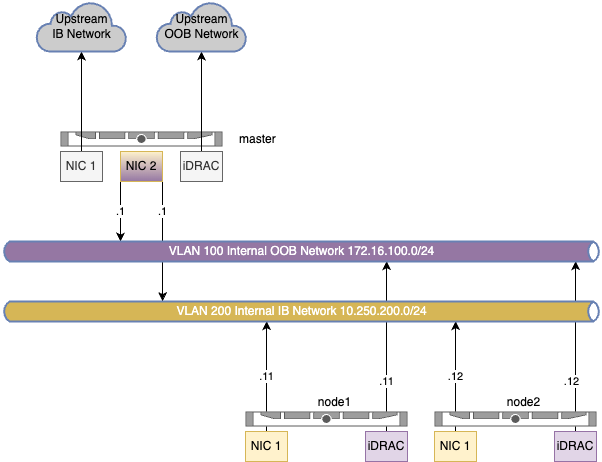

# Local environment
The local `vagrant`-based environment's goal is to serve as a reference for a physical testing lab. It supports development for scripts, ansible playbooks etc. that can be used to setup actual infrastructure. It does not support running tests against its nodes. **Its current state is a work in progress. It can probably be replaced by a separate containerlab setup or by modifying the existing containerlab setup to use manual k8s installation.**

It requires `libvirt`/`kvm`.

## Usage
```shell
$ make up
…
```

## Network architecture


